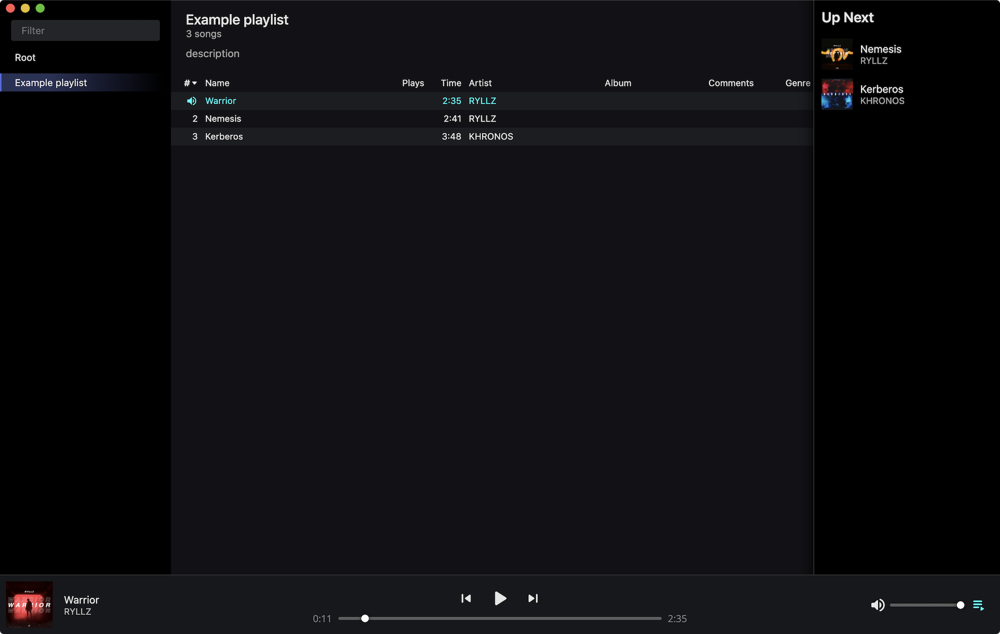

	

<h3 align="center">Ferrum</h3>

	Music library and player
	 
	<a href="https://github.com/probablykasper/ferrum/releases"><b>Download for Mac, Windows or Linux</b></a>

 

## Dev instructions

### Get started

1. Install Node.js
2. Install Rust
3. Run `npm install`

### Commands
- `npm run dev`: Start app in dev mode
- `npm run build`: Build
- `npm run lint`: Lint
- `npm run format`: Format

### Publish new version
1. Run `npm run check`
2. Update `CHANGELOG.md`
3. Run `npm version --no-git-tag <version>` to bump the version number
4. Create a git tag in the format `v#.#.#`
5. Add release notes to the generated GitHub release and publish it
